# PHP - Apache configuration

-Truy cập vào trang web, chúng ta có thể thấy có chức năng để upload file lên hệ thống. Thử upload 1 file ảnh với ext là jpg => thành công upload.
Thử upload 1 file .php lên => bị chặn không được uploadupload
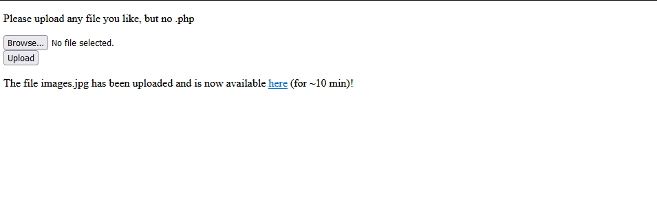


Trong php vẫn bắt được request upload file PHP
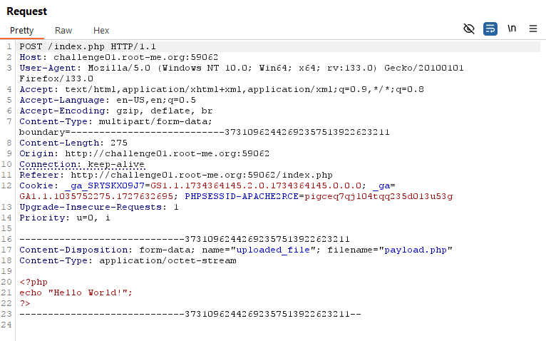
- Thử truy cập vào file flag => không có quyền truy cậpcập
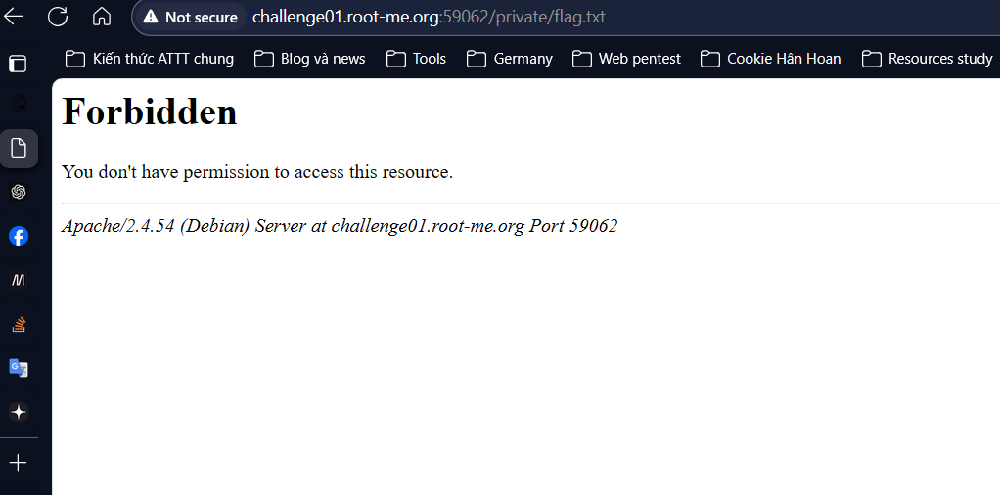
- Theo research, trong taì liệuliệu .htaccess, khi config trong .htaccess là Options All + Indexes được dùng để liệt kê các file và thư mục có trong thư mục cha. 
- Tạo 1 file .htaccess với nội dung là Options All + Indexes và upload lên server => upload thành công file .htaccess và khi truy cập vào thì sẽ truy cập và liệt kê được các file đang có trong thư mục cha.
- upload thành công => có thể kiẻme soát phần setting trong folder này
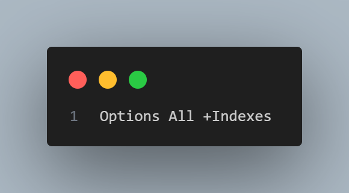

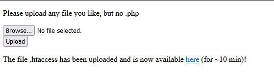

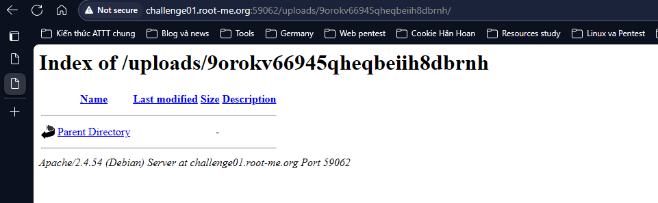

- Trong tài liệu .htaccess phần SetHandler được dùng để thay đổi cách xử lí tệp để thực thi.  

  ```plaintext
  <FilesMatch "payload">: dùng để lấy những file nào có tên là payload, sau đó được set để thực thi php nếu trong file payload đó là mã php 
  ```

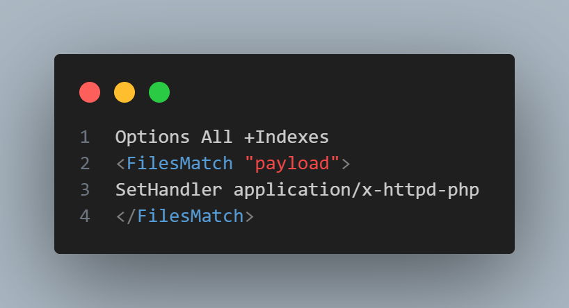

- Sau khi upload file .htaccess để có thể xử lí php với file có tên payload, tạo 1 file payload với nội dung dưới đây, sau đó upload lên server. Sau khi upload không thấy có gì xảy ra => có thể có 1 tệp cấu hình chung cho việc thực thi PHP bị vô hiệu hóa

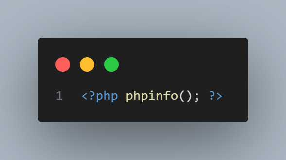

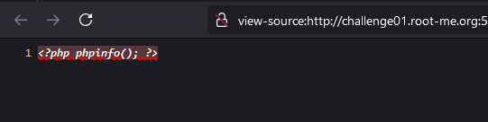

- Trong apache, mod_php(version).c là 1 module dùng để tích hợp PHP với Apache. php_flag_engine được dùng để thiết lập php có được thực thi hay không. Nếu là off thì mã PHP sẽ chỉ được coi là văn bản, không được thực thi.
- Thử với PHP5 trước tiên => đoạn mã PHP vẫn không được thực thithi

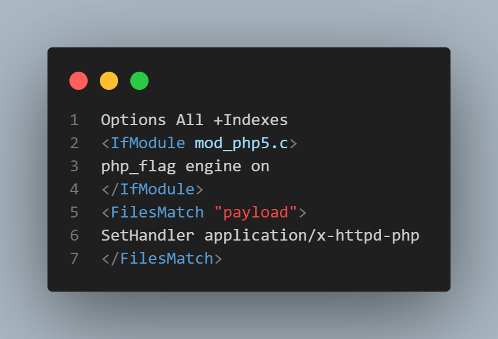

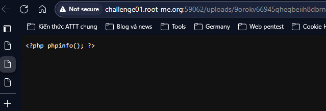


- Thử với PHP7 => đoạn mã đã được thực thi và chúng ta đọc được cấú hình của php trên server => server đang dùng PHP7 dểd thực thi mã PHPPHP

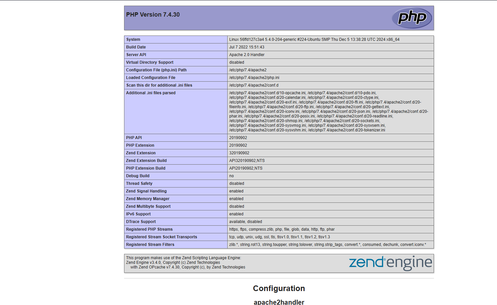

- Upload đoạn mã lên để đọc file flag và chúng ta có được flag cần tìm.

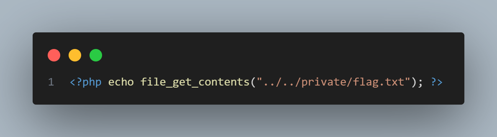

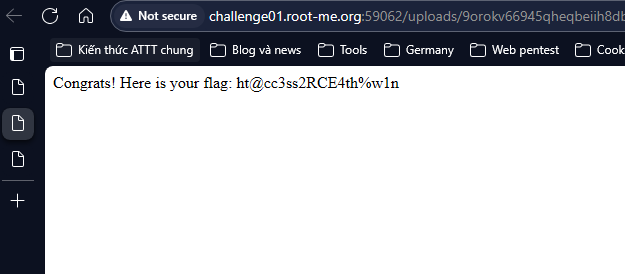