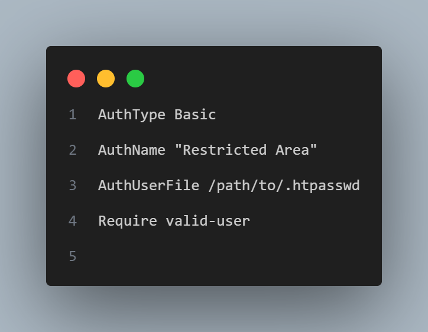
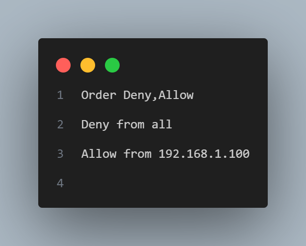
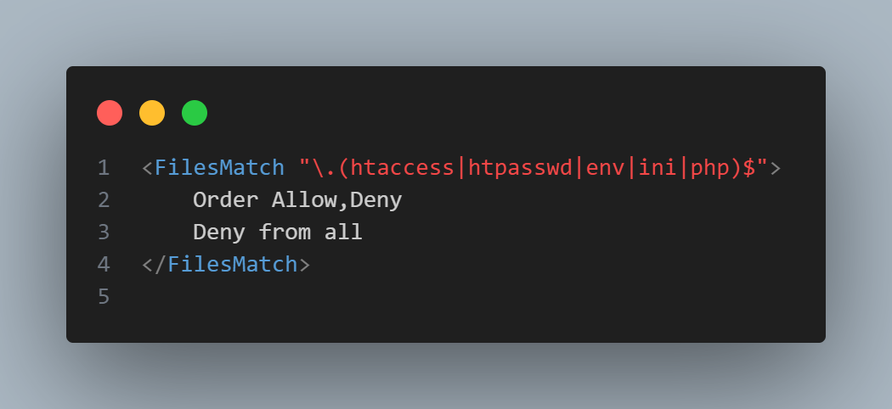
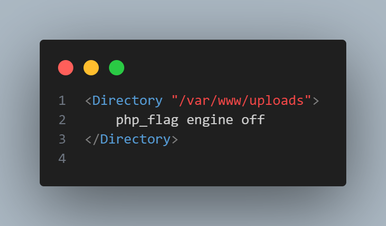
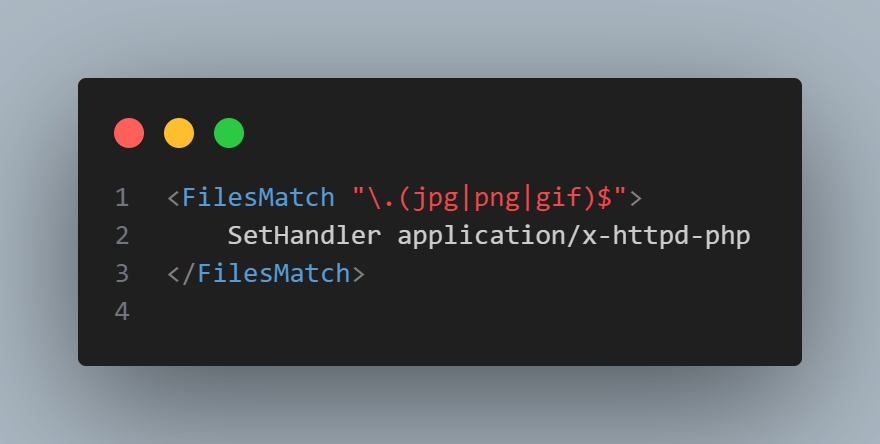
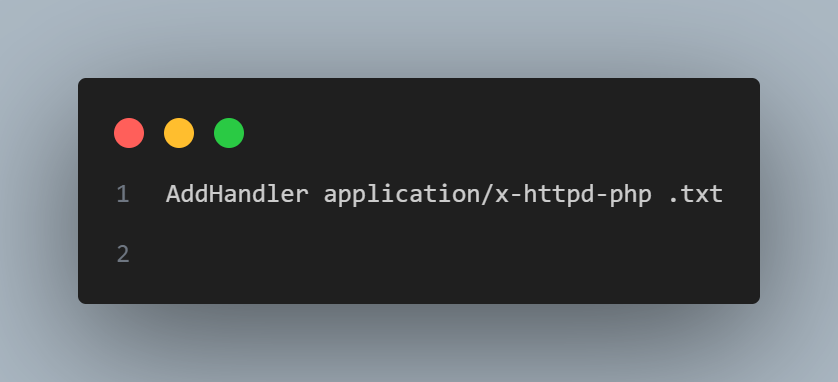
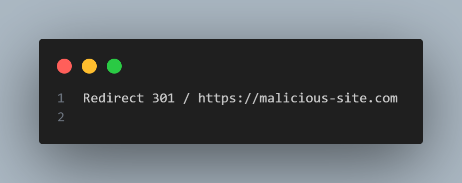
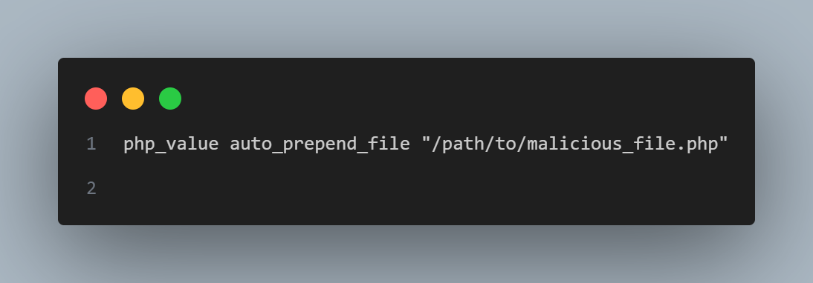
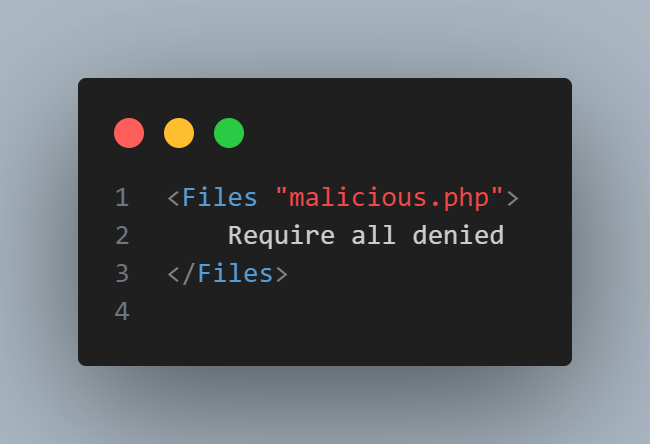

# Apache HTTP Server Tutorial: .htaccess files

## 1, Định nghĩa .htaccess

- .htaccess là một tệp văn bản đơn giản (plain text file) được sử dụng bởi máy chủ web Apache để thay đổi các cài đặt cấu hình chỉ áp dụng cho một thư mục cụ thể và các thư mục con của nó.
- Thay vì thay đổi cấu hình trực tiếp trong tệp cấu hình chính của Apache (thường là httpd.conf), bạn có thể sử dụng .htaccess để áp dụng các quy tắc cho từng thư mục mà không cần quyền root trên máy chủ.
- .htaccess cung cấp khả năng kiểm soát linh hoạt mà không cần chỉnh sửa tệp cấu hình chính.
- Dễ dàng thiết lập các biện pháp an toàn thông tin trực tiếp trong môi trường PHP-Apache.

## 2, Các chức năng bảo mật của .htaccess

- Mật khẩu bảo vệ thư mục
  - Dùng AuthType và .htpasswd để yêu cầu xác thực:
    

- Chặn IP
  - chỉ cho phép truy cập hoặc chặn truy cập từ các địa chỉ IP cụ thể
    

- Ngăn chặn truy cập tệp nhạy cảm
  - Bảo vệ tệp hệ thống và mã nguồn:
    

- Hạn chế thực thi mã độc
  - Vô hiệu hóa thực thi PHP trong thư mục tải lên
    

## 3, So sánh .htaccess với cấu hình trực tiếp trong httpd.conf

- Ưu điểm của .htaccess:
  - Linh hoạt cho từng thư mục.
  - Không yêu cầu quyền root trên máy chủ.

- Hạn chế của .htaccess:
  - Giảm hiệu suất do Apache phải kiểm tra .htaccess ở mỗi cấp thư mục.
  - Rủi ro bảo mật khi không kiểm soát tốt nội dung.

## 4, Các lỗi cấu hình thường gặp

- Bật Directory Listing (+Indexes) không cần thiết
  - Ví dụ: 
    - Options All +Indexes: kích hoạt tính năng Directory Listing (hiển thị danh sách các tệp trong thư mục) trên Apache 

## 5, Các payload thường dùng với .htaccess

- Thay đổi cách xử lý tệp để thực thi mã độc

- Tạo chuyển hướng (Redirect) để đánh cắp thông tin

- Thêm mã độc vào tệp PHP hợp lệ

- Che giấu hành vi độc hại
