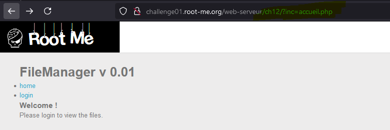
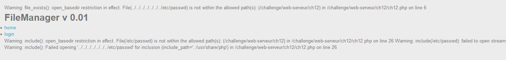
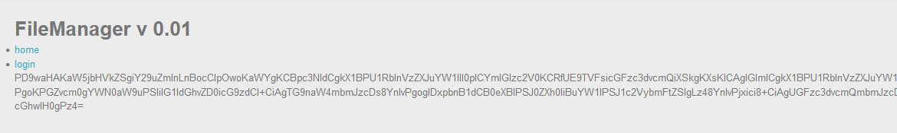
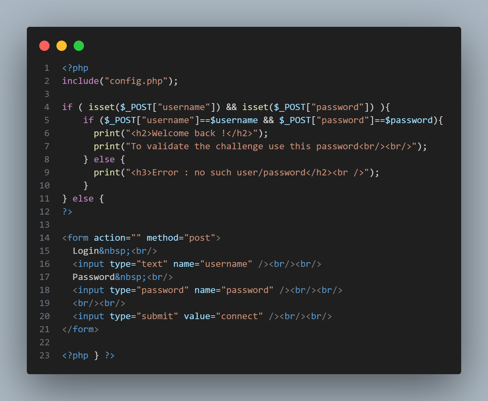
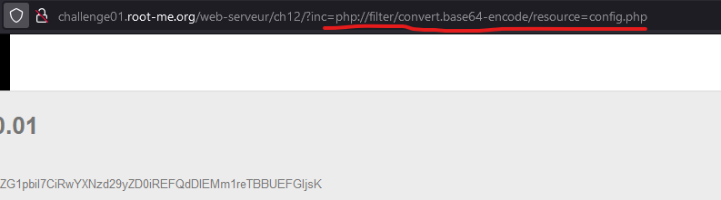
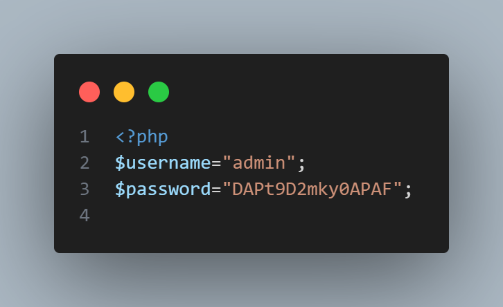
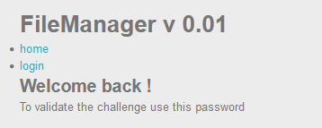

# Title of the Writeup

- Thấy rằng trang web xử lí các page bằng function `include`. Chúng ta thử path traversal đến /etc/passwd => hiện ra thông báo lỗi và cảnh báo hàm `include` không thể mở file này => suy đoán đúng => có thể thấy rằng đây là lỗi LFI. 

- Bypass với phương pháp PHP Wrappers => đọc file bằng phương pháp mã hóa base64 với `php://filter`. Vì để bài yêu cầu cần có password để đăng nhập và đọc file => chúng ta sẽ đọc file `login.php`. Giải mã nội dung file login.php 

- Trong đoạn code login.php, chúng ta thấy có hàm `include("config.php")`. Chúng ta sẽ đọc file config.php bằng cách như đọc file login.php

- Giải mã nội dung file config.php => trong file config này chứa username và password => có được flag.

