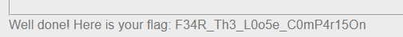

# PHP - Loose Comparison

- [PHP - Loose Comparison](#php---loose-comparison)
  - [Tìm hiểu về PHP type juggling](#tìm-hiểu-về-php-type-juggling)
  - [Các lỗ hổng có thể xảy ra](#các-lỗ-hổng-có-thể-xảy-ra)
    - [Authentication Bypass](#authentication-bypass)
    - [Magic Hashes](#magic-hashes)
  - [Phân tích đề bài](#phân-tích-đề-bài)

## Tìm hiểu về PHP type juggling

- Trong C/C++, Java... khi khai báo biến chúng ta cần định nghĩa cả kiểu dữ liệu cho nó, nhưng đối với PHP, Python, hay Javascript khi khai báo biến thì chỉ cần khai báo tên biến mà không cần định nghĩa thêm kiểu dữ liệu.
- PHP có 2 kiểu so sánh là == và ===, hai kiểu so sánh này trả về BOOLEAN (TRUE/FALSE), hai kiểu so sánh này lại rất khác nhau.
    - Toán tử so sánh === chỉ trả về TRUE khi hai biến so sánh giống nhau về giá trị và kiểu dữ liệu.
    - Toán tử so sánh == nếu như kiểu dữ liệu khác nhau nó sẽ đưa về một kiểu dữ liệu chung để thực hiện việc so sánh
- Cách so sánh 
  
  | Biểu thức         | Kết quả chuyển đổi | Giá trị cuối | Nhận định |
  |-------------------|--------------------|--------------|-----------|
  | `"0000" == 0`     | `"0000" -> 0`     | `0 == 0`     | TRUE      |
  | `"0e12" == 0`     | `"0e12" -> 0`     | `0 == 0`     | TRUE      |
  | `"0e12345" == "0"` | Cả hai -> `0`     | `0 == 0`     | TRUE      |
  | `"0abc" == 0`     | `"0abc" -> 0`     | `0 == 0`     | TRUE      |
  | `"abc" == 0`      | `"abc" -> 0`      | `0 == 0`     | TRUE      |
  | `"0e12345" == "0e54321"` | Cả hai -> `0` | `0 == 0`   | TRUE      |
  | `"0e12345" <= "1"`| `"0e12345" -> 0`  | `0 <= 1`     | TRUE      |
  | `"1abc" == 1`     | `"1abc" -> 1`     | `1 == 1`     | TRUE      |
  | `"0xF" == "15"`   | `"0xF" -> 15`     | `15 == 15`   | TRUE      |
  
## Các lỗ hổng có thể xảy ra

### Authentication Bypass
- Ta có 1 đoạn mã PHP như sau: 
  
  ```php
  if ($_SERVER['REQUEST_METHOD'] == 'POST'){
        $data = json_decode(file_get_contents("php://input"));
        if($data->{'username'} == "admin" && $data->{'password'} == "admin"){
                echo "success";
                header('location: admin');
        }
        else{ 
                echo "failed";
                header("location: login");
        }
  }
  ```

- Khi người dùng đăng nhập với test/test => kết quả sẽ là failed. Nhưng thay vì đăng nhập bằng các chuỗi, ta đăng nhập với giá trị số nguyên `0`.  Khi đó PHP thực hiện so sánh string với interger, nếu như string không bắt đầu là 1 số thì string mặc định được ép kiểu về int(0). Vậy nên biểu thức so sánh vô tình trở thành: `0 == "admin" -> TRUE`
- Tuy nhiên việc xác thực này thông qua json nên người dùng mới có thể thay đổi được type của input, nếu như input là tham số của POST, GET, hay COOKIE thì input được gửi đi dưới dạng string hoàn toàn không thể thay đổi được type nên việc so sánh dẫn đến việc so sánh 2 string: `"0" == "admin" -> FALSE`
- Nhưng nếu ứng dụng chấp nhận các input thông qua các hàm như json_decode() hay unserialize() thì người dùng có thể thay đổi type của input giống như ở trên.


### Magic Hashes

- Khi so sánh một string với một số interger trong PHP, nếu như string bắt đầu bằng một ký tự không phải là số, nó sẽ mặc định là int(0): `'abc...000' == 0 -> TRUE`
- Ví dụ: 
  
  ```php
  <?php
        $key = "0e124656823434657657655654324342";
        if(isset($_COOKIE['key']) && md5($_COOKIE['key']) == $key) {
                // access
        }
        else {
                // error
        }
  ?>
  ```

- Đoạn mã trên với input cookie key = '240610708' hoàn toàn có thể bypass việc check key, vì khi md5 giá trị 240610708 sẽ được một string 0e462097431906509019562988736854 mà khi đem so sánh với key trên server là 0e124656823434657657655654324342 khi đó PHP sẽ ngầm định so sánh

  ```text
  0e124656823434657657655654324342 = int(0) 
  0e462097431906509019562988736854 = int(0)
  => 0e462097431906509019562988736854 == 0e124656823434657657655654324342
  ```

  ```php
  md5($_COOKIE['key']) == $key;
  md5('240610708') == '0e124656823434657657655654324342'
  => '0e462097431906509019562988736854' == '0e124656823434657657655654324342' -> TRUE
  ```

## Phân tích đề bài

```php
<html>
<body>
 <form action="index.php" class="authform" method="post" accept-charset="utf-8">
        <fieldset>
            <legend>Unbreakable Random</legend>
            <input type="text" id="s" name="s" value="" placeholder="seed" />
            <input type="text" id="h" name="h" value="" placeholder="hash" />
            <input type="submit" name="submit" value="Check" />

        <div class="return-value" style="padding: 10px 0">&nbsp;</div>
        </fieldset>
        </form>
<?php
function gen_secured_random() { // cause random is the way
    $a = rand(1337,2600)*42;
    $b = rand(1879,1955)*42;

    $a < $b ? $a ^= $b ^= $a ^= $b : $a = $b;

    return $a+$b;
}

function secured_hash_function($plain) { // cause md5 is the best hash ever
    $secured_plain = sanitize_user_input($plain);
    return md5($secured_plain);
}

function sanitize_user_input($input) { // cause someone told me to never trust user input
    $re = '/[^a-zA-Z0-9]/';
    $secured_input = preg_replace($re, "", $input);
    return $secured_input;
}

if (isset($_GET['source'])) {
    show_source(__FILE__);
    die();
}


require_once "secret.php";

if (isset($_POST['s']) && isset($_POST['h'])) {
    $s = sanitize_user_input($_POST['s']);
    $h = secured_hash_function($_POST['h']);
    $r = gen_secured_random();
    if($s != false && $h != false) {
        if($s.$r == $h) {
            print "Well done! Here is your flag: ".$flag;
        }
        else {
            print "Fail...";
        }
    }
    else {
        print "<p>Hum ...</p>";
    }
}
?>
<p><em><a href="index.php?source">source code</a></em></p>
</body>
</html>
```

- Người dùng nhập vào 2 trường là seed và hash, sau đó code thực hiện `sanitize_user_input()` để loại bỏ mọi kí tự `[a-zA-Z0-9]`
- Sau đó đoạn code `secured_hash_function()` để mã hóa `md5`. Sau đó nó sẽ kiểm tra điều kiện `if ($s . $r == $h)`, nêú đúng thì in ra flag, sai thì in ra Fail.
- Theo tìm hiểu ở trên, trong php, 1 chuỗi số `0e124656823434657657655654324342` sẽ được hiểu là `int(0)`. Và 1 chuỗi mã hóa `md5(240610708)` sẽ cho kết quả là `0e124656823434657657655654324342` cũng được hiểu là `int(0)`. => ta sẽ bypass bằng cách cho `seed = 0e462097431906509019562988736854` và `hash=240610708` => bypass thành công 
  
