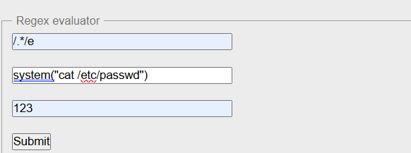
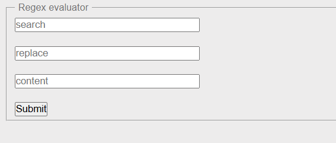
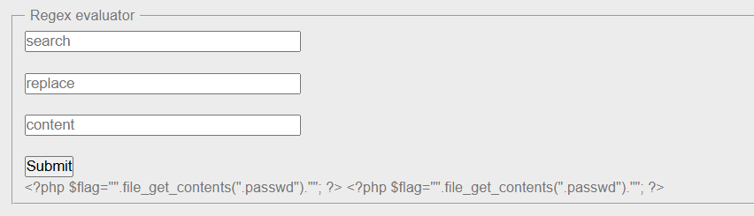

# PHP - preg_replace

- [PHP - preg\_replace](#php---preg_replace)
  - [Khái niệm về preg\_replace()](#khái-niệm-về-preg_replace)
  - [Lỗ hổng liên quan preg\_replace()](#lỗ-hổng-liên-quan-preg_replace)
    - [e Modifier là gì](#e-modifier-là-gì)
    - [Ví dụ về tấn công](#ví-dụ-về-tấn-công)
  - [Khai thác lỗ hổng trên rootme](#khai-thác-lỗ-hổng-trên-rootme)

## Khái niệm về preg_replace()

- Hàm preg_replace() trong PHP thực hiện tìm kiếm và thay thế trên một chuỗi hoặc mảng các chuỗi dựa trên biểu thức chính quy (regular expression). Kết quả trả về là một chuỗi hoặc mảng các chuỗi đã được thay thế.
- Cách sử dụng: `preg_replace(patterns, replacements, input, limit, count)`
- Ví dụ: 
  - Input: 
    ```php
      <?php
      $str = 'Visit Microsoft!';
      $pattern = '/microsoft/i';
      echo preg_replace($pattern, 'W3Schools', $str);
      ?>
    ```
  - Output: `Visit W3Schools!`

## Lỗ hổng liên quan preg_replace()

  ### e Modifier là gì 
  - Modifier e trong PHP làm cho preg_replace() xử lý tham số replacement như mã PHP, sau khi các tham chiếu (references) đã được thay thế.
  - Cách hoạt động của modifier e:
    - Khi bạn sử dụng e, hàm preg_replace() sẽ thay thế tất cả các phần khớp trong chuỗi input bằng kết quả của việc thực thi mã PHP trong replacement string.
    - Đây là tính năng mạnh mẽ nhưng nguy hiểm, vì mã trong replacement có thể chứa các biểu thức hoặc lệnh PHP.

  ### Ví dụ về tấn công 

  ```php
  $input = "123";
  $pattern = '/.*/';
  $replacement = 'system("ls");'; 

  echo preg_replace($pattern, $replacement, $input, -1, PREG_REPLACE_EVAL);
  ```

  - Với modifier e, PHP sẽ thực thi lệnh system("ls"); và hiển thị kết quả của lệnh này.
  - Bắt đầu từ PHP 7.0, modifier e đã bị loại bỏ 

## Khai thác lỗ hổng trên rootme 

- Chúng ta sẽ khai thác lỗ hổng với payload sau: 
  
- Thực thi và không thấy kết quả trả về. Chúng ta sẽ thử với các hàm thực thi hệ thống khác như `exec()`, `passthrough()`, `backstick` => không hàm nào thực thi được => có thể hệ thống chặn các hàm hệ thốngthống
  

- Nhớ ra rằng trên PHP có hàm đọc file là `file_get_contents()` => chúng ta sẽ dùng hàm này để đọc file flag.php
  

- Đã đọc được file flag.php và biết rằng flag nằm trong file .passwd => dùng `file_get_contents()` để đọc tiếp file .passwd => có được flag